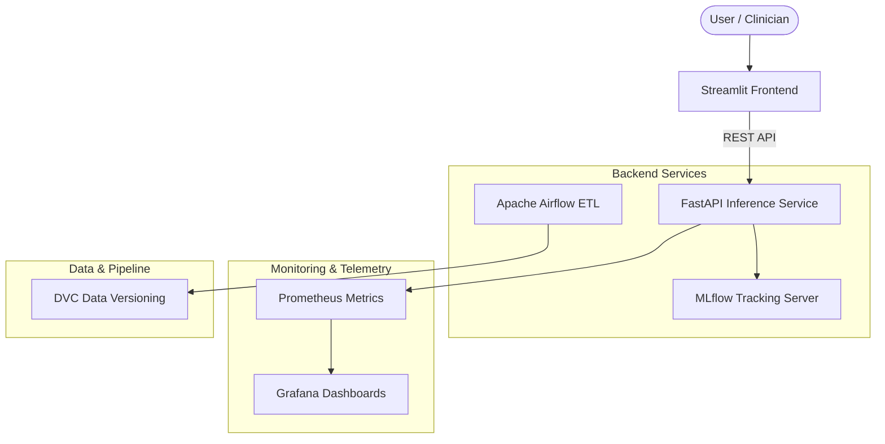

# Architecture Document

## System Architecture

The CerebroNet platform is designed with a decoupled, microservice-oriented architecture running on local infrastructure without cloud dependencies. The system is orchestrated via Docker Compose and leverages industry-standard MLOps tooling.

### Component Details
1. **Frontend**: A Streamlit application rendering an interactive, "container-less" UI.
2. **Backend**: FastAPI providing the REST endpoint for the deep learning model.
3. **MLOps Tracking**: MLflow tracking experiments and model artifacts.
4. **Data Engineering**: Apache Airflow automating ETL and DVC managing data artifacts.
5. **Observability**: Prometheus scraping metrics from FastAPI, and Grafana visualizing them.
